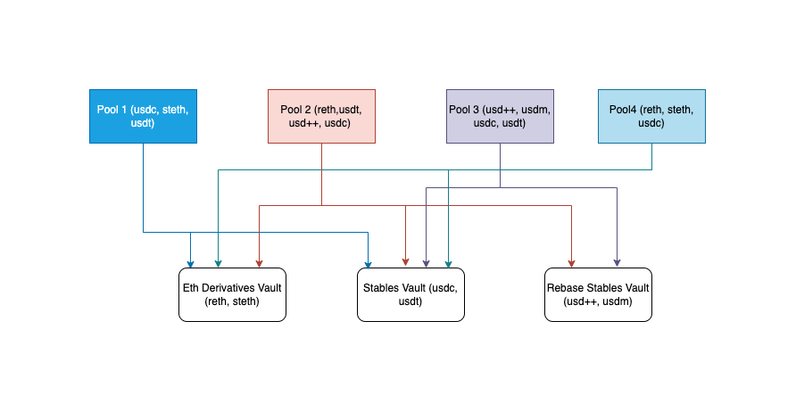

# Aave V3.1 Origin


Aave v3.1 complete codebase, Foundry-based.

[](https://aave-dao.github.io/aave-v3-origin)
<br>

## Dependencies

- Foundry, [how-to install](https://book.getfoundry.sh/getting-started/installation) (we recommend also update to the last version with `foundryup`)
- Lcov
  - Optional, only needed for coverage testing
  - For Ubuntu, you can install via `apt install lcov`
  - For Mac, you can install via `brew install lcov`

<br>

## Setup

```sh
cp .env.example .env

forge install

# optional, to install prettier
bun install
```

<br>

## Tests

- To run the full test suite: `make test`
- To re-generate the coverage report: `make coverage`

<br>

## Documentation

- [Aave v3 technical Paper](./techpaper/Aave_V3_Technical_Paper.pdf)
- [v3 to v3.0.2 production upgrade](https://github.com/bgd-labs/proposal-3.0.2-upgrade/blob/main/README.md)
- [Aave v3.1 features](./docs/Aave-v3.1-features.md)

<br>

## Security

Aave v3.1 is an upgraded version of Aave v3, more precisely on top of the initial Aave v3 release and a follow-up 3.0.2 later update.

The following are the security procedures historically applied to Aave v3.X versions.

<br>

**-> Aave v3**

- [ABDK](./audits/27-01-2022_ABDK_AaveV3.pdf)
- [OpenZeppelin](./audits/01-11-2021_OpenZeppelin_AaveV3.pdf)
- [Trail of Bits](./audits/07-01-2022_TrailOfBits_AaveV3.pdf)
- [Peckshield](./audits/14-01-2022_PeckShield_AaveV3.pdf)
- [SigmaPrime](./audits/27-01-2022_SigmaPrime_AaveV3.pdf)
- [Certora](./certora/Aave_V3_Formal_Verification_Report_Jan2022.pdf)

<br>

**-> Aave v3.0.1 - December 2022**

- [PeckShield](./audits/09-12-2022_PeckShield_AaveV3-0-1.pdf)
- [SigmaPrime](./audits/23-12-2022_SigmaPrime_AaveV3-0-1.pdf)

<br>

**-> Aave v3.0.2 - April 2023**

- [SigmaPrime](./audits/19-04-2023_SigmaPrime_AaveV3-0-2.pdf)
- [Certora](./audits/03-2023_2023_Certora_AaveV3-0-2.pdf)

<br>

**-> Aave v3.1 - April 2024**

- [Certora](./audits/30-04-2024_Certora_AaveV3.1.pdf)
- [MixBytes](./audits/02-05-2024_MixBytes_AaveV3.1.pdf)
- An internal review by [SterMi](https://twitter.com/stermi) on the virtual accounting feature was conducted on an initial phase of the codebase.
- Additionally, Certora properties have been improved over time since the Aave v3 release. More details [HERE](./certora/README.md).

<br>

### Bug bounty

This repository will be subjected to [this bug bounty](https://immunefi.com/bounty/aave/) once the Aave Governance upgrades the smart contracts in the applicable production instances.

<br>

## Project Overview

This project implements a sophisticated DeFi protocol with advanced features including:

- KYC (Know Your Customer) integration
- Semi-permissioned pools
- Vault management
- Custody control
- Multi-token support

## Files in scope

- src/core/contracts/protocol/partner/KYCPortal.sol
- src/core/contracts/protocol/partner/KYCId.sol
- src/core/contracts/protocol/partner/CustodyController.sol
- src/core/contracts/protocol/pool/SemiPermissionedPool.sol
- src/core/contracts/protocol/vault/Vault.sol
- src/core/contracts/protocol/vault/VaultFactory.sol
- src/core/contracts/protocol/vault/VaultController.sol
- src/core/contracts/protocol/libraries/logic/BorrowLogic.sol
- src/core/contracts/protocol/libraries/logic/BridgeLogic.sol
- src/core/contracts/protocol/libraries/logic/LiquidationLogic.sol
- src/core/contracts/protocol/libraries/logic/SupplyLogic.sol
- src/core/contracts/protocol/tokenization/AToken.sol
- src/core/contracts/protocol/configuration/ACLManager.sol

## Potential Security Focus Areas

- KYC bypass for SemiPermissioned Pools
- DOS on SemiPermissioned Pools despite having KYC Id and approved on KYC portal
- DOS due to custodian logic especially on withdraw
- Access control
- Loss of funds especially in Vault
- Vault sort issue in Vault controller

## Additions

### Vaults

The vault is designed to mimic the Morpho vault, allowing curators to create new vaults. Multiple pools can be added to the ERC4626 vault, provided the pool supports the underlying token. The vault controller simplifies vault selection by helping users find the most performing vaults for their tokens, while supporting multiple tokens simultaneously.

### KYC

The KYCId and KYCPortal form the core infrastructure for Know Your Customer (KYC) compliance in the protocol. To enhance security and decentralization, the ownership of the KYC Portal is transferred to a timelock contract. This strategic move allows for a controlled, automated management approach, as the portal is primarily designed to be operated by autonomous bots.
The transfer to a timelock contract serves multiple purposes:

- Introduces a time-delayed governance mechanism
- Prevents immediate, unilateral changes to KYC settings
- Enables programmatic and predictable portal management
- Reduces human intervention while maintaining system integrity

By leveraging bot-driven operations, the KYC system can:

- Process identity verifications efficiently
- Maintain consistent compliance checks
- Minimize manual administrative overhead
- Provide real-time access control for the protocol

### Custody

The protocol's unique custody mechanism addresses token security by transferring certain tokens to a third-party custodian through a dedicated custody controller. For withdrawing tokens from custody and pools, users must:

- Submit a withdrawal request specifying:
  - Target address
  - Calldata (e.g., withdraw 50 USDC from pool 0x003)
- Custodian bot process:
  - Initiate withdrawal to custody controller
  - Call update status function
  - Transfer freshly withdrawn tokens to the corresponding AToken address

Each reserve has a dedicated custody controller, ensuring granular and secure token management. This approach provides an additional layer of security and controlled token movement within the protocol.
Key benefits:

- Enhanced token security
- Controlled withdrawal mechanisms
- Automated, bot-driven processes
- Per-reserve custody management

## License

Copyright © 2024, Aave DAO, represented by its governance smart contracts.

The [BUSL1.1](./LICENSE) license of this repository allows for any usage of the software, if respecting the Additional Use Grant limitations, forbidding any use case damaging anyhow the Aave DAO's interests.
Interfaces and other components required for integrations are explicitly MIT licensed.

## Tranches architecture



## Overview

The system is designed to extend the functionality of Aave V3 Origin and its safety module by introducing a dual-tranche lending model. This solution splits user deposits into two tranches:

- [Junior Tranche (Pool)](https://github.com/mystic-finance/lending-v3-origin/tree/mfi-v1): The primary lending pool where deposits are supplied and borrowers interact.
- [Senior Tranche (Vault)](https://github.com/mystic-finance/aave-stk-gov-v3/tree/senior-vault): An insurance layer that covers losses and replenishes liquidity in the pool when needed. The Senior tranche is a vault of assets with similar value and risk profile, for example stables vault, and eth derivatives vault. This is to allow modularity, allowing one vault serving multiple pools, and one pool connected to multiple vaults further segmenting risks.

A key enhancement in this system is the dynamic inter-tranche coordination that allows pools to borrow liquidity from the senior tranche—even beyond the current vault balance—to bootstrap new pools with higher borrow pressure than supplies. This design minimizes changes to the core Aave contracts by leveraging wrapper contracts and hooks for coordination.

## Architecture

### Tranche Model

#### Dual Tranche System:

Deposits are split between a junior pool and a senior vault. The vault serves as a liquidity buffer and loss absorber, ensuring that the junior pool can maintain operations even in adverse conditions.

#### Liquidity Sharing & Borrowing:

Pools can borrow additional liquidity from the vault beyond the vault’s immediate balance. This feature is particularly useful during the initial bootstrapping of new pools where borrow demand may exceed current supplies. The mechanism provides flexibility to accommodate high borrow pressure until supply levels adjust.

### Components

#### Tranche Wrapper (Router):

##### Role:

Acts as the central router coordinating deposits, withdrawals, and liquidity flows between the junior pool and the senior vault.

##### Functions:

Splits deposits based on configurable ratios.
Routes funds via before/after hooks during liquidity events.
Facilitates rebalancing operations and liquidity borrowing.

#### Multi-Asset Vault:

##### Role:

Manages similar assets in a unified vault to reduce valuation friction.

##### Design:

LP tokens are minted based directly on deposited amounts (near 1:1), with adjustments from rewards or slashing events.
Provides liquidity to pools as needed through rebalancing functions.

##### Key Feature:

Supports liquidity borrowing that allows pools to draw funds beyond the vault's current balance—bootstrapping new pools under high borrow demand.

#### Pool Wrapper & Hooks:

##### Role:

Minimal wrapper contracts around core Aave pool functions that inject before and after hooks.

##### Functions:

- Before Hook:

Checks pool liquidity before withdrawals or borrows. If insufficient, it triggers a call via the wrapper to fetch funds from the vault.

- After Hook:

Detects liquidity shortfalls or bad debt after operations and initiates rebalancing from the vault.

## Inter-Tranche Coordination & Rebalancing

The system implements a series of hooks and coordination mechanisms to ensure robust liquidity management between the tranches:

- Before Hooks (Pool):

Prior to liquidity removal operations (withdraw or borrow), the pool calls a hook to verify available funds. If the pool lacks sufficient liquidity, the wrapper automatically requests additional funds from the vault.

- After Hooks (Pool):

Following liquidity operations, the pool calls a hook to detect any resulting bad debt. In such cases, the wrapper triggers a rebalancing process that transfers funds from the vault to cover deficits.

- Liquidity Borrowing Feature:

A notable enhancement allows pools to borrow more liquidity from the vault than the vault’s current on-chain balance might suggest. This bootstrapping mechanism supports scenarios where new pools experience high borrowing demand, enabling rapid growth and market penetration before supply levels catch up.

## Modifications to the Aave V3 Codebase

- Minimal Core Changes:
  Custom logic is primarily implemented in wrapper contracts and hook functions to minimize modifications to the core Aave V3 Origin and safety module codebases.

- Wrapper Contracts:

The tranche wrapper encapsulates deposit-splitting, liquidity routing, and rebalancing logic, thereby interfacing seamlessly with existing Aave protocols.

- Hook Integration:

Before/after hooks are injected into key pool operations (such as supply, borrow, repay, and withdraw) to enable dynamic liquidity management and inter-tranche coordination.

## Security & Risk Management

- Risk Segmentation:

The dual tranche system segregates risks by designating the junior tranche as the operational lending pool and the senior tranche as an insurance layer.

- Automatic Liquidity Checks:

Integrated hooks continuously monitor liquidity levels and bad debt, triggering automated rebalancing actions to safeguard the system.

- Controlled Liquidity Borrowing:

The ability for pools to borrow extra liquidity is controlled and monitored, ensuring that bootstrapping new pools does not compromise the overall stability of the system.

- Robust Access Controls & Auditing:

Administrative functions and critical operations are secured with strict access controls. All operations are logged for comprehensive auditability, and the system is subject to third-party security audits.

## Work in progress

- Dynamic Interest Rate Models:
  Further refine interest rate models to adjust dynamically based on utilization metrics and risk factors.

- Expanded Multi-Asset Support:
  Explore granular risk models for a broader range of assets while maintaining the grouping of similar assets for simplified valuation.

- Expanded Collateral Support:
  Explore models for bypassing senior tranches to maximize collateral value and borrowing power.

- Enhanced Liquidity Management:
  Optimize the liquidity borrowing mechanism with additional safeguards and performance metrics to ensure sustainable bootstrapping of new pools.

## Conclusion

This tranche-based lending system extends Aave V3's robust framework by introducing a dual-tranche model that enhances risk management and liquidity efficiency. Through the use of wrapper contracts, dynamic inter-tranche coordination, and an innovative liquidity borrowing feature, the platform is designed to support high borrow demand—particularly during the bootstrapping of new pools—without compromising safety.

This README serves as a detailed technical overview for external auditors, venture capitalists, and technical teams, demonstrating the forward-thinking and robust design of the system. Continued testing, rigorous auditing, and iterative improvements will further ensure the platform’s security and performance.

For further details or technical discussions, please refer to the accompanying technical documentation and source code repositories.
